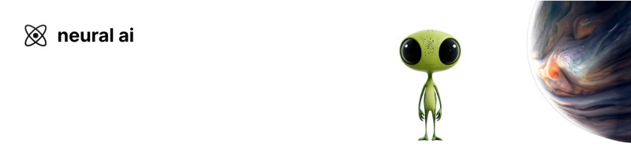

### hey, i'm roshan

co-founder @ **[NeuralAI](https://neuralai.in)** · undergrad @ **IIT Madras**

working on cognitive architectures — AI that keeps a persistent memory,
reasons across time, and consolidates what it learns instead of forgetting it
the moment the context window closes.

security engineer by trade. i build products, then break them before anyone else does.

**building**

- **[Anant 1.0](https://neuralai.in)** — persistent structured memory, belief-state architecture, multi-channel retrieval, consolidation cycles. private alpha.

**stack** — python · typescript · react · next · postgres · supabase · burp

**elsewhere** — [neuralai.in](https://neuralai.in) · [x](https://x.com/roshansingh_01) · [linkedin](https://www.linkedin.com/in/roshannsingh/) · [office@neuralai.in](mailto:office@neuralai.in)
